# 🐦 Twitter-like Application — Monolith to Microservices

A simplified **Twitter-like web application** that evolves from a *Spring Boot* monolith into **serverless AWS Lambda microservices**, secured end-to-end with **Auth0** JWT authentication. Authenticated users can publish posts of up to **140 characters** in a single public stream, while anyone can read the feed without logging in.

---

## 📋 Table of Contents

- [Project Description](#-project-description)
- [Architecture Overview](#-architecture-overview)
- [Tech Stack](#-tech-stack)
- [Project Structure](#-project-structure)
- [Local Setup & Execution](#-local-setup--execution)
- [Application Demo](#-application-demo)
- [API Reference](#-api-reference)
- [Auth0 Configuration](#-auth0-configuration)
- [Test Report](#-test-report)
- [AWS Deployment](#-aws-deployment)
- [Video Demo](#-video-demo)
- [Authors](#-authors)
- [License](#-license)
- [Additional Resources](#-additional-resources)

---

## 📝 Project Description

This project implements a public microblogging feed across two architectural phases:

1. **Phase 1 — Monolith**
   - A single *Spring Boot* application exposing a RESTful API
   - Persistence via *Spring Data JPA* with an *H2* in-memory database (development)
   - Full *OpenAPI 3* documentation with *Swagger UI*
   - JWT-based security enforced by **Auth0** as the identity provider

2. **Phase 2 — Microservices on AWS**
   - The monolith is decomposed into **three independent AWS Lambda functions**
   - Each service is backed by its own *Amazon DynamoDB* table
   - The *React* frontend is hosted as a static website on *Amazon S3*
   - Routing is handled by *Amazon API Gateway*

---

## 🏗️ Architecture Overview

### Phase 1 — Monolith

The first phase consolidates all application concerns — security, business logic, persistence — into a **single deployable Spring Boot unit**.

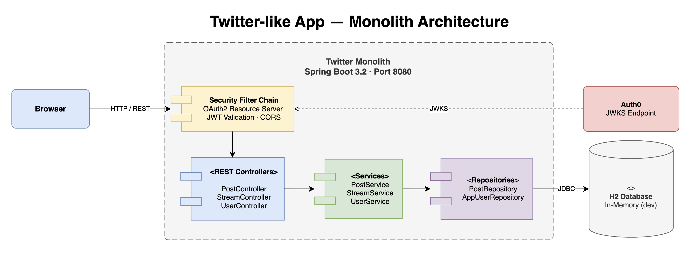

- **Security Filter Chain** validates every incoming JWT against Auth0's JWKS endpoint before the request reaches any controller
- **REST Controllers** (`PostController`, `StreamController`, `UserController`) handle routing and response mapping
- **Services** (`PostService`, `StreamService`, `UserService`) encapsulate all business rules
- **Repositories** (`PostRepository`, `AppUserRepository`) persist data via *Spring Data JPA*
- **H2 Database** stores all entities in memory during local development (`create-drop` strategy)

### Phase 2 — Microservices on AWS

The monolith is refactored into **three independent, stateless Lambda functions** — each deployed separately, scaling independently, and owning its own data.

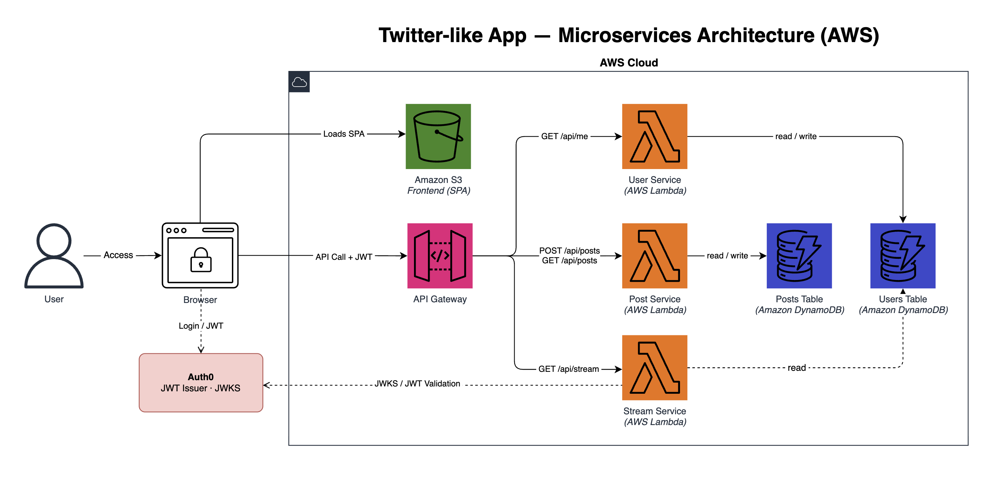

| Service | Handler | Endpoints | Storage |
|---|---|---|---|
| **Post Service** | `PostHandler` | `GET` / `POST` `/api/posts` | DynamoDB — Posts table |
| **Stream Service** | `StreamHandler` | `GET /api/stream` | DynamoDB — Posts table (read-only) |
| **User Service** | `UserHandler` | `GET /api/me` | DynamoDB — Users table |

### 🔐 Auth0 Security Flow

```
User ──► Auth0 Login ──► JWT Access Token (RS256)
      ◄── redirect ─────────────────────────────
SPA attaches Bearer token to every protected API call
Backend validates: issuer ✔  audience ✔  JWKS signature ✔
```

---

## 🛠️ Tech Stack

| Layer | Technology |
|---|---|
| **Frontend** | *React 18*, *Vite 5*, Auth0 React SDK, *Axios* |
| **Monolith backend** | *Spring Boot 3.2*, Spring Security OAuth2, Spring Data JPA |
| **Microservices** | *AWS Lambda* (Java 17), Amazon API Gateway, Amazon DynamoDB |
| **Authentication** | **Auth0** (JWT, JWKS, RS256) |
| **Database — monolith** | *H2* (dev) · *PostgreSQL* (prod) |
| **Database — microservices** | *Amazon DynamoDB* |
| **API documentation** | *SpringDoc OpenAPI 3* / *Swagger UI* |
| **Build tool** | *Apache Maven 3.x* |
| **Static hosting** | *Amazon S3* |

---

## 📁 Project Structure

```
AREP-laboratory-7-microservices/
│
├── twitter-monolith/                    ← Phase 1: Spring Boot monolith
│   ├── pom.xml
│   └── src/main/java/edu/eci/arep/
│       ├── config/                      ← SecurityConfig, OpenApiConfig
│       ├── controller/                  ← PostController, StreamController, UserController
│       ├── dto/                         ← PostRequest, PostResponse, UserResponse
│       ├── entity/                      ← AppUser, Post
│       ├── exception/                   ← GlobalExceptionHandler, UserNotFoundException
│       ├── repository/                  ← AppUserRepository, PostRepository
│       └── service/                     ← PostService, StreamService, UserService (+ Impls)
│
├── microservices/                       ← Phase 2: AWS Lambda functions
│   ├── post-service/                    ← GET | POST /api/posts
│   ├── stream-service/                  ← GET /api/stream
│   └── user-service/                    ← GET /api/me
│   Each service follows the same layout:
│       handler/   ← Lambda entry point (RequestHandler)
│       service/   ← Business logic
│       model/     ← Domain model
│       dto/       ← Response DTOs
│       util/      ← Auth0TokenValidator (JWKS)
│
├── frontend/                            ← React SPA (deployed on Amazon S3)
│   ├── src/
│   │   ├── components/{auth,post,stream}
│   │   ├── pages/                       ← HomePage, ProfilePage
│   │   └── services/apiService.js       ← Axios calls to backend
│   ├── .env.example                     ← Environment variable template
│   └── vite.config.js
│
├── assets/
│   ├── images/                          ← Architecture diagrams & screenshots
│   └── videos/                          ← Demo recordings
│
└── .claude/
    └── settings.json                    ← Shared Claude Code permissions
```

---

## 🚀 Local Setup & Execution

### ✅ Prerequisites

- **Java 17** — verify with `java -version`
- **Maven 3.8+** — verify with `mvn -version`
- **Node.js 18+** — verify with `node -v`
- An [Auth0](https://auth0.com) account with a configured **SPA Application** and **API**
  - See [Auth0 Configuration](#-auth0-configuration) for the full setup guide

### Step 1 — Configure environment variables

Set the following in your shell before starting the monolith:

```bash
export AUTH0_ISSUER_URI="https://YOUR-DOMAIN.auth0.com/"   # must end with /
export AUTH0_AUDIENCE="https://your-api-audience"
```

Create `frontend/.env` from the template:

```bash
cp frontend/.env.example frontend/.env
```

Fill in your Auth0 values:

```
VITE_AUTH0_DOMAIN=your-domain.auth0.com
VITE_AUTH0_CLIENT_ID=your-spa-client-id
VITE_AUTH0_AUDIENCE=https://your-api-audience
VITE_API_BASE_URL=http://localhost:8080
```

> ⚠️ **Never commit** `.env` files or Auth0 credentials to the repository.

### Step 2 — Start the monolith backend

```bash
cd twitter-monolith
mvn spring-boot:run
```

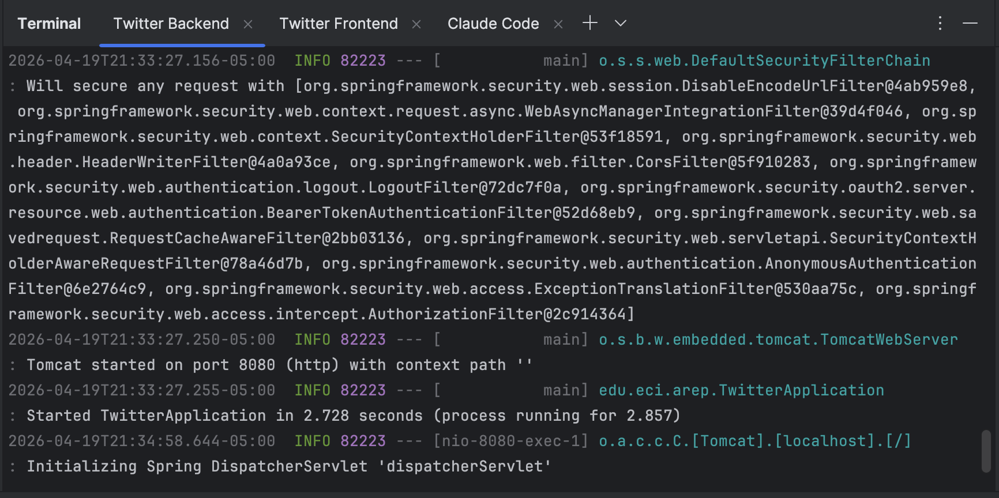

The backend is ready when the terminal shows:
```
Started TwitterApplication in X.XXX seconds
```

Available URLs:
- **API base:** `http://localhost:8080/api`
- **Swagger UI:** `http://localhost:8080/swagger-ui.html`
- **H2 Console:** `http://localhost:8080/h2-console`

### Step 3 — Start the frontend

Open a second terminal:

```bash
cd frontend
npm install       # first time only
npm run dev
```

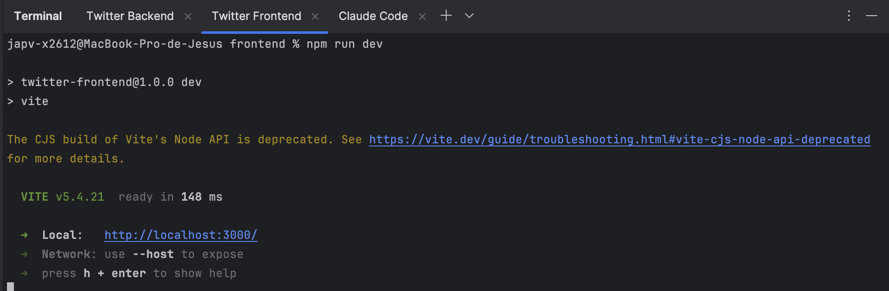

The frontend is available at `http://localhost:3000`.

### Step 4 — Run the tests

```bash
# Monolith
cd twitter-monolith && mvn test

# Microservices
cd microservices/post-service    && mvn test
cd microservices/stream-service  && mvn test
cd microservices/user-service    && mvn test
```

---

## 🖥️ Application Demo

### 🔑 Authentication

Navigate to `http://localhost:3000`. Unauthenticated users see the login screen:

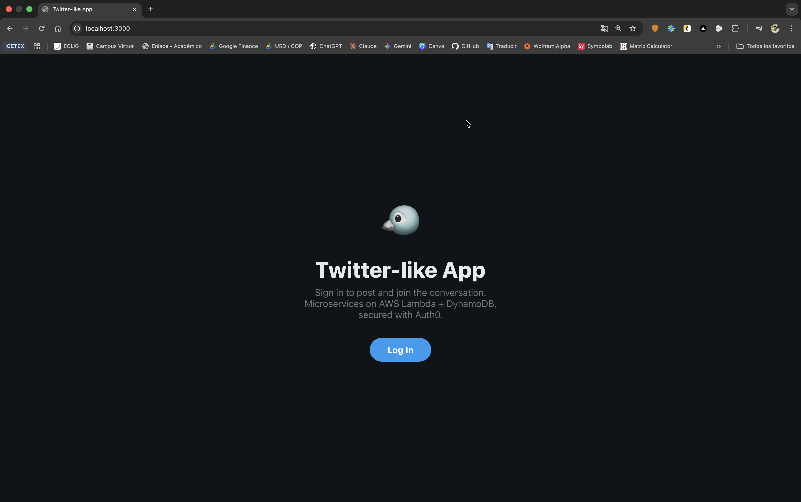

Clicking **Log In** redirects to the **Auth0** login page:

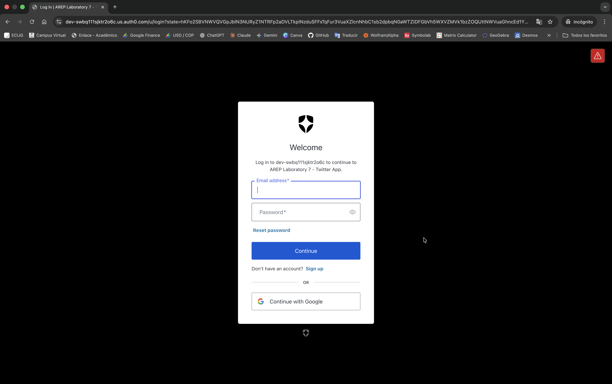

After successful authentication, the user is redirected back to the application:

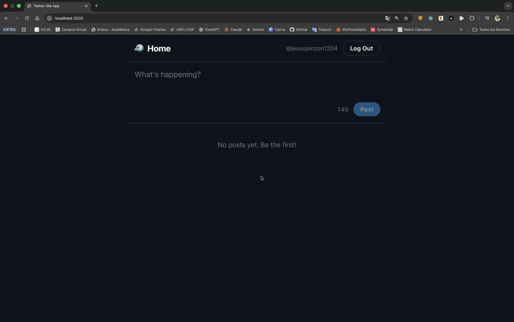

### ✍️ Creating a Post

Authenticated users can compose a post of up to **140 characters** and submit it:

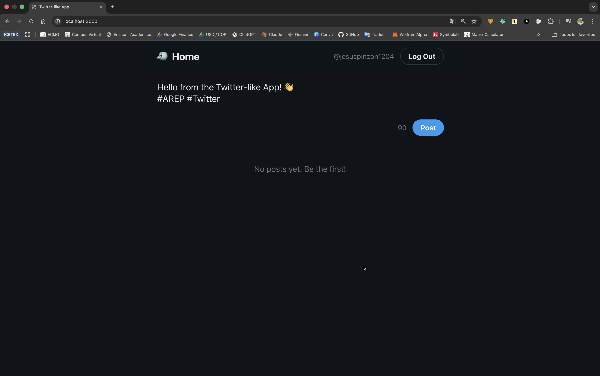

The post appears immediately in the public stream:

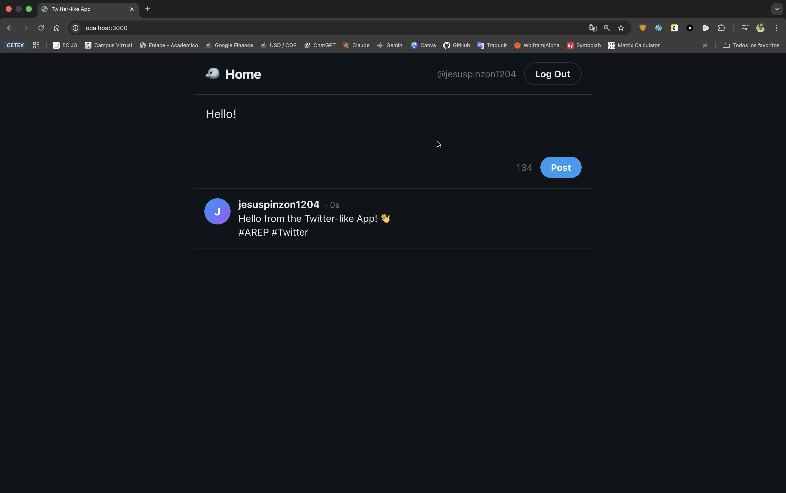

As more posts are created, the stream displays them ordered from **newest to oldest**:

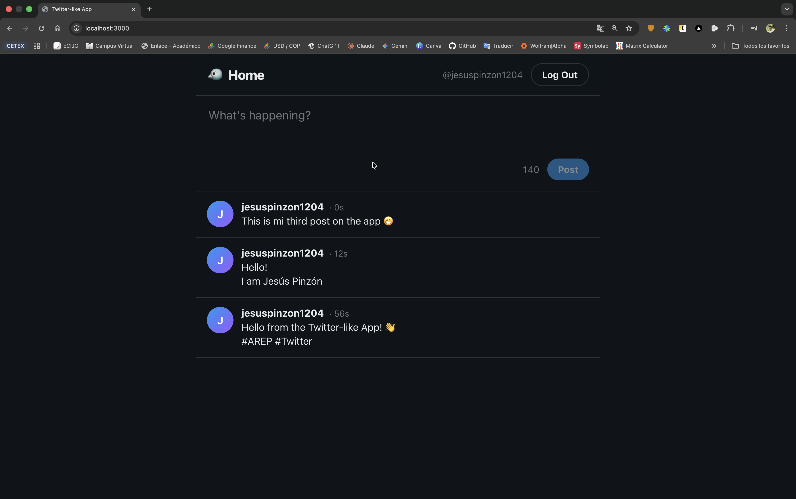

### 📄 API Documentation — Swagger UI

The monolith exposes full *OpenAPI 3* documentation at `http://localhost:8080/swagger-ui.html`:

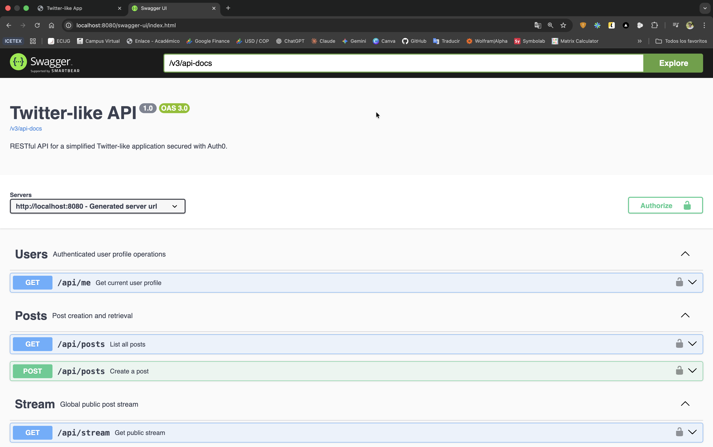

Protected endpoints require a Bearer token — paste it via the **Authorize** button:

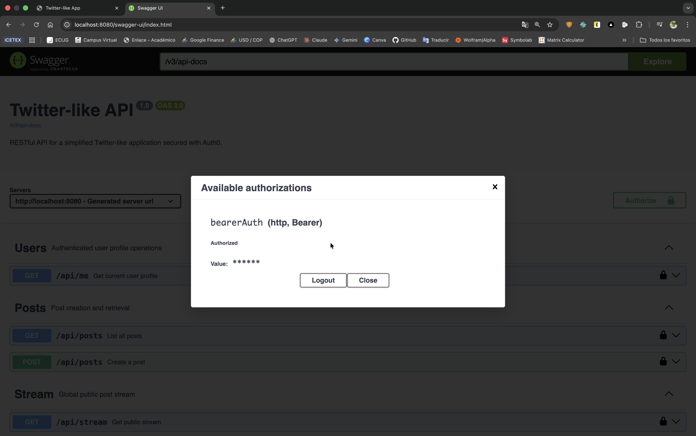

#### `GET /api/me` — Authenticated user profile

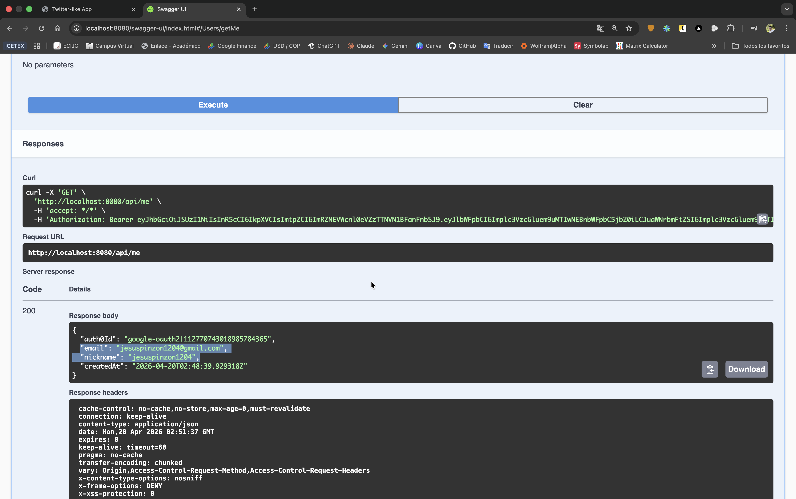

#### `POST /api/posts` — Create a post

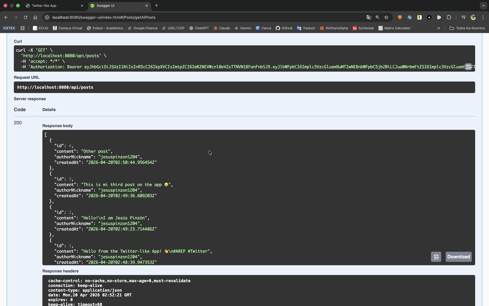

### 🚪 Logout

Clicking **Log Out** ends the session and returns to the login screen:

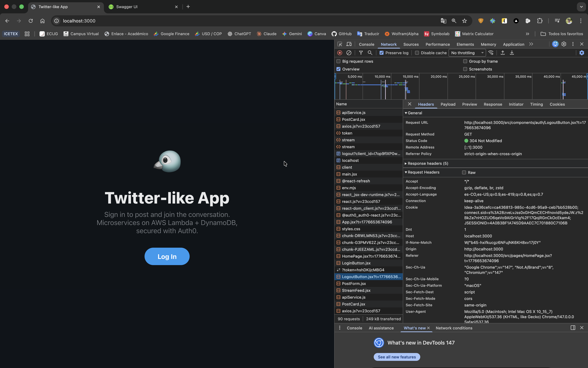

---

## 📡 API Reference

### Public Endpoints *(no authentication required)*

| Method | Path | Description |
|---|---|---|
| `GET` | `/api/posts` | List all posts, newest first |
| `GET` | `/api/stream` | Global public post stream |

### Protected Endpoints *(require `Authorization: Bearer <token>`)*

| Method | Path | Description |
|---|---|---|
| `POST` | `/api/posts` | Create a new post (max 140 characters) |
| `GET` | `/api/me` | Get the authenticated user's profile |

#### `POST /api/posts` — Request body

```json
{
  "content": "Hello, world!"
}
```

#### `POST /api/posts` — Response `201 Created`

```json
{
  "id": 1,
  "content": "Hello, world!",
  "authorNickname": "alice",
  "createdAt": "2026-04-17T12:00:00Z"
}
```

---

## 🔒 Auth0 Configuration

### Required Auth0 entities

**1. Single Page Application** (for the frontend)

| Setting | Value |
|---|---|
| Application Type | *Single Page Application* |
| Allowed Callback URLs | `http://localhost:3000`, `https://your-s3-bucket.s3-website.amazonaws.com` |
| Allowed Logout URLs | `http://localhost:3000`, `https://your-s3-bucket.s3-website.amazonaws.com` |
| Allowed Web Origins | `http://localhost:3000`, `https://your-s3-bucket.s3-website.amazonaws.com` |
| Token Endpoint Auth Method | `None` |

**2. API** (for the backend — monolith and microservices)

| Setting | Value |
|---|---|
| Name | `Twitter-like API` |
| Identifier (Audience) | `https://twitter-api.arep.eci.edu.co` |
| Signing Algorithm | `RS256` |

Both the monolith and every Lambda function act as **OAuth2 Resource Servers** and share the same `AUTH0_ISSUER_URI` and `AUTH0_AUDIENCE` values.

### Post Login Action — include `email` and `nickname` in the access token

Auth0 does not include user claims in access tokens by default. Create a **Post Login Action** with the following code and attach it to the *Login* flow:

```javascript
exports.onExecutePostLogin = async (event, api) => {
  if (event.authorization) {
    api.accessToken.setCustomClaim('email', event.user.email);
    api.accessToken.setCustomClaim('nickname', event.user.nickname);
  }
};
```

> **Path in Auth0 Dashboard:** *Actions → Library → Create Action → Login / Post Login → Deploy → Actions → Triggers → post-login → drag action into flow → Apply Changes*

---

## 🧪 Test Report

### Monolith — Unit & Slice Tests

| Test Class | Scenario | Expected Result | Status |
|---|---|---|---|
| `PostServiceTest` | Create post with existing user | Post persisted and returned | ✅ |
| `PostServiceTest` | Create post with unknown user | `UserNotFoundException` thrown | ✅ |
| `PostServiceTest` | Get all posts | Ordered list returned | ✅ |
| `StreamServiceTest` | Get stream | Delegates to repository | ✅ |
| `StreamServiceTest` | Empty stream | Empty list returned | ✅ |
| `PostControllerTest` | `GET /api/posts` without token | `200 OK` | ✅ |
| `PostControllerTest` | `POST /api/posts` without token | `401 Unauthorized` | ✅ |
| `PostControllerTest` | `POST /api/posts` with valid JWT | `201 Created` | ✅ |
| `PostControllerTest` | `POST` with blank content | `400 Bad Request` | ✅ |
| `StreamControllerTest` | `GET /api/stream` | `200 OK` with all posts | ✅ |
| `StreamControllerTest` | `GET /api/stream` — empty | `200 OK` with empty array | ✅ |

### Microservices — Lambda Unit Tests

| Test Class | Scenario | Expected Result | Status |
|---|---|---|---|
| `PostHandlerTest` | `GET` (public) | `200 OK` with post list | ✅ |
| `PostHandlerTest` | `POST` without token | `401 Unauthorized` | ✅ |
| `PostHandlerTest` | `POST` with valid token | `201 Created` | ✅ |
| `PostHandlerTest` | `POST` with blank content | `400 Bad Request` | ✅ |
| `StreamHandlerTest` | `GET /api/stream` | `200 OK` with posts | ✅ |
| `StreamHandlerTest` | Empty stream | `200 OK` with empty array | ✅ |
| `UserHandlerTest` | Valid JWT → resolve user | `200 OK` with profile | ✅ |
| `UserHandlerTest` | Missing Authorization header | `401 Unauthorized` | ✅ |
| `UserHandlerTest` | Invalid token | `401 Unauthorized` | ✅ |

---

## ☁️ AWS Deployment

### 🌐 Live Environment

| Component | URL |
|---|---|
| **Frontend** (Amazon S3) | https://twitter-frontend-arep-dv.s3.us-east-1.amazonaws.com/index.html |
| **API Gateway** (stage: `prod`) | https://r84uoiai71.execute-api.us-east-1.amazonaws.com/prod |

> **Note:** HTTPS is served directly by the S3 REST endpoint — no *CloudFront* is required (and is unavailable in *AWS Academy* accounts).

### AWS Resources

#### Lambda Functions — region `us-east-1` · runtime *Java 17* · memory 512 MB

| Function name | Handler | Environment variables |
|---|---|---|
| `twitter-post-service` | `edu.eci.arep.handler.PostHandler` | `POSTS_TABLE=Posts`, `AUTH0_ISSUER_URI`, `AUTH0_AUDIENCE` |
| `twitter-stream-service` | `edu.eci.arep.handler.StreamHandler` | `POSTS_TABLE=Posts` |
| `twitter-user-service` | `edu.eci.arep.handler.UserHandler` | `USERS_TABLE=Users`, `AUTH0_ISSUER_URI`, `AUTH0_AUDIENCE` |

#### DynamoDB Tables — on-demand billing

| Table | Partition key |
|---|---|
| `Posts` | `id` (String) |
| `Users` | `auth0Id` (String) |

#### Amazon S3

| Bucket | Region | Access |
|---|---|---|
| `twitter-frontend-arep-dv` | `us-east-1` | Public read via bucket policy |

### Step-by-step Deployment

#### 1 — Build Lambda JARs

```bash
cd microservices/post-service    && mvn clean package -DskipTests
cd ../stream-service              && mvn clean package -DskipTests
cd ../user-service                && mvn clean package -DskipTests
```

#### 2 — Create DynamoDB tables

```bash
aws dynamodb create-table --table-name Posts \
  --attribute-definitions AttributeName=id,AttributeType=S \
  --key-schema AttributeName=id,KeyType=HASH \
  --billing-mode PAY_PER_REQUEST

aws dynamodb create-table --table-name Users \
  --attribute-definitions AttributeName=auth0Id,AttributeType=S \
  --key-schema AttributeName=auth0Id,KeyType=HASH \
  --billing-mode PAY_PER_REQUEST
```

#### 3 — Create Lambda functions

```bash
ROLE=arn:aws:iam::<ACCOUNT_ID>:role/LabRole

for SVC in post stream user; do
  aws lambda create-function \
    --function-name twitter-${SVC}-service \
    --runtime java17 \
    --handler edu.eci.arep.handler.${SVC^}Handler \
    --role "$ROLE" \
    --zip-file fileb://microservices/${SVC}-service/target/${SVC}-service-1.0-SNAPSHOT.jar \
    --timeout 30 --memory-size 512
done
```

#### 4 — Set environment variables per function

```bash
aws lambda update-function-configuration --function-name twitter-post-service \
  --environment 'Variables={POSTS_TABLE=Posts,AUTH0_ISSUER_URI=https://YOUR-DOMAIN.auth0.com/,AUTH0_AUDIENCE=https://your-api-audience}'

aws lambda update-function-configuration --function-name twitter-stream-service \
  --environment 'Variables={POSTS_TABLE=Posts}'

aws lambda update-function-configuration --function-name twitter-user-service \
  --environment 'Variables={USERS_TABLE=Users,AUTH0_ISSUER_URI=https://YOUR-DOMAIN.auth0.com/,AUTH0_AUDIENCE=https://your-api-audience}'
```

#### 5 — Create API Gateway

Create a REST API with three child resources under `/api` — `posts`, `stream`, and `me`. Each method uses `AWS_PROXY` integration pointing to its Lambda function. Enable CORS with an `OPTIONS` mock integration on each resource and deploy to stage `prod`.

#### 6 — Build and deploy the frontend

```bash
cd frontend
cat > .env <<EOF
VITE_AUTH0_DOMAIN=your-domain.auth0.com
VITE_AUTH0_CLIENT_ID=your-spa-client-id
VITE_AUTH0_AUDIENCE=https://your-api-audience
VITE_API_BASE_URL=https://your-api-id.execute-api.us-east-1.amazonaws.com/prod
EOF

npm install && npm run build

# Create and configure the S3 bucket
aws s3 mb s3://your-bucket-name
aws s3api put-public-access-block --bucket your-bucket-name \
  --public-access-block-configuration \
  "BlockPublicAcls=false,IgnorePublicAcls=false,BlockPublicPolicy=false,RestrictPublicBuckets=false"
aws s3api put-bucket-policy --bucket your-bucket-name \
  --policy '{
    "Version": "2012-10-17",
    "Statement": [{
      "Sid": "PublicReadGetObject",
      "Effect": "Allow",
      "Principal": "*",
      "Action": "s3:GetObject",
      "Resource": "arn:aws:s3:::your-bucket-name/*"
    }]
  }'

# Upload the production build
aws s3 sync dist/ s3://your-bucket-name/ --delete
```

### Verifying the deployment

Use the following `curl` commands to confirm each endpoint is live:

```bash
API=https://r84uoiai71.execute-api.us-east-1.amazonaws.com/prod

# Public endpoints — should return 200
curl -s "$API/api/stream"          # → {"posts":[...]}
curl -s "$API/api/posts"           # → [...]

# Protected endpoint — should return 401 without a token
curl -s -w "%{http_code}\n" "$API/api/me"    # → 401

# CORS headers — should return Access-Control-Allow-Origin: *
curl -s -X OPTIONS -D - "$API/api/stream" | grep -i access-control
```

---

## 🎬 Video Demo

### Phase 1 — Monolith

A full walkthrough of the *Spring Boot* monolith: Auth0 login, post creation, public stream, Swagger UI, and endpoint testing.

[▶ Watch Monolith Demo](assets/videos/1-twitter-monolith-app-video-demo.mp4)

### Phase 2 — Microservices on AWS

End-to-end demonstration of the microservices deployment on *AWS Lambda* + *API Gateway* + *Amazon S3*, secured with **Auth0**.

[▶ Watch Microservices Demo](assets/videos/2-twitter-microservices-app-video-demo.mp4)

---

## 👥 **Authors**

<table>
  <tr>
    <td align="center">
      <a href="https://github.com/DavidVCAI">
        
        <br />
        <sub><b>David Velásquez</b></sub>
      </a>
      <br />
      <sub>Full Stack Developer</sub>
    </td>
    <td align="center">
      <a href="https://github.com/JAPV-X2612">
        
        <br />
        <sub><b>Jesús Alfonso Pinzón Vega</b></sub>
      </a>
      <br />
      <sub>Full Stack Developer</sub>
    </td>
    <td align="center">
      <a href="https://github.com/buba-0511">
        
        <br />
        <sub><b>Santiago Díaz</b></sub>
      </a>
      <br />
      <sub>Full Stack Developer</sub>
    </td>
  </tr>
</table>

---

## 📄 License

This project is licensed under the **Apache License, Version 2.0, January 2004**.
See the [LICENSE](LICENSE) file for the full terms and conditions.

---

## 🔗 **Additional Resources**

- [Spring Boot Reference Documentation](https://docs.spring.io/spring-boot/docs/current/reference/html/)
- [Spring Security — OAuth2 Resource Server](https://docs.spring.io/spring-security/reference/servlet/oauth2/resource-server/jwt.html)
- [Auth0 — Spring Boot Quickstart](https://auth0.com/docs/quickstart/backend/java-spring-security5)
- [Auth0 — React SDK Documentation](https://auth0.com/docs/libraries/auth0-react)
- [Auth0 — Post Login Actions](https://auth0.com/docs/customize/actions/flows-and-triggers/login-flow)
- [SpringDoc OpenAPI](https://springdoc.org/)
- [AWS Lambda — Java Runtime](https://docs.aws.amazon.com/lambda/latest/dg/lambda-java.html)
- [AWS SDK for Java v2 — DynamoDB](https://docs.aws.amazon.com/sdk-for-java/latest/developer-guide/examples-dynamodb.html)
- [Amazon API Gateway — REST APIs](https://docs.aws.amazon.com/apigateway/latest/developerguide/apigateway-rest-api.html)
- [Amazon S3 — Static Website Hosting](https://docs.aws.amazon.com/AmazonS3/latest/userguide/WebsiteHosting.html)
- [Vite — Getting Started](https://vitejs.dev/guide/)
- [React — Official Documentation](https://react.dev/)
- [JSON Web Tokens — Introduction](https://jwt.io/introduction)
